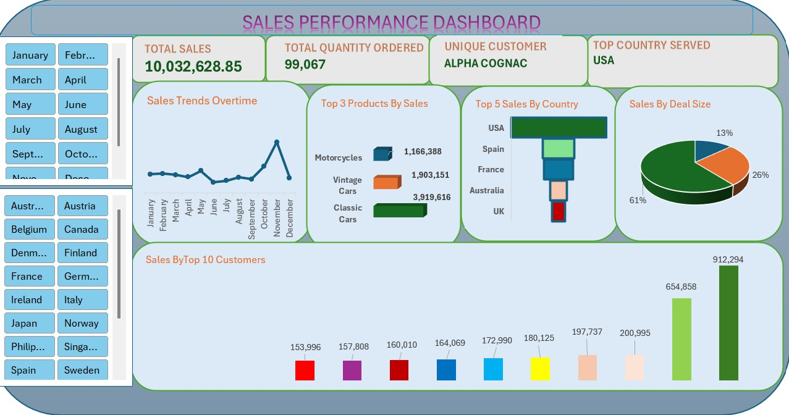

# Project 1

**Title:** [Sales Performance Analysis](https://github.com/Bigwillys1978/william27.github.io/blob/main/Sales%20Performance%20Data.xlsx)

**Tools Used:** Microsoft Excel, Pivot Tables, Pivot Charts (Column, Line),Conditional Formatting,Basic data cleaning & sorting,slicers,Date-based aggregation (Month, Quarter, Year)

**Project Description:** This project analyses a 2003 sales dataset containing customer orders across multiple countries and territories. The dataset includes detailed transactional information such as order numbers, quantities ordered, unit prices, total sales values, order dates, product lines, customer locations, and deal sizes.

**The purpose of the analysis is to:**

Evaluate overall sales performance.

Identify high-value customers and regions.

Understand monthly and quarterly sales trends.

Support data-driven business decisions using Excel dashboards.

**Key finding:** 

Classic Cars, Vintage Cars and Motorcycles are the product lines that generates consistent sales across all months.

October and November record the highest sales volumes, indicating strong Q4 performance.

Medium deal sizes contribute more revenue than Small deals, despite fewer transactions.

USA, Spain, France, Australia and UK are the top-performing countries by total sales.

Customers such as Euro Shopping Channel and Mini Gifts Distributed Ltd generate higher average order values and sales.

**Dashboard Overview:** The Excel dashboard provides an interactive overview of sales performance using Pivot Tables and charts, including:

Total Sales KPI
Displays overall revenue generated.

Sales by Month (Line Chart)
Shows monthly sales trends to identify peak periods.

Sales by Country (Funnel Chart)
Compares revenue contribution across countries.

Sales by Deal Size (Pie Chart)
Visualises revenue distribution by Small and Medium deals.

Top Customers (Column Chart)
Highlights customers with the highest total sales.

Slicers were used for:
Countries.
Months.
This allows users to dynamically filter and explore sales performance

